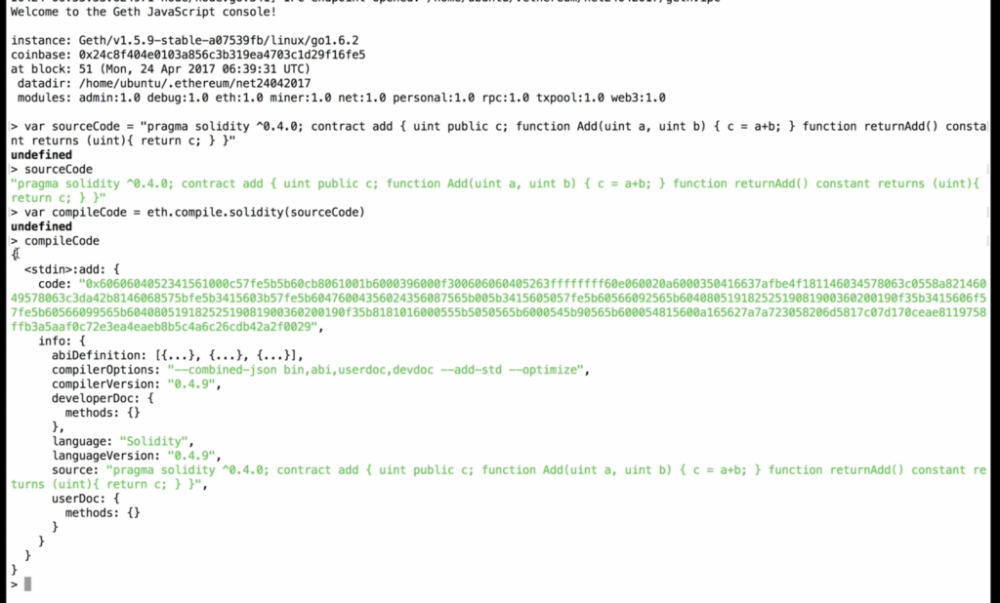
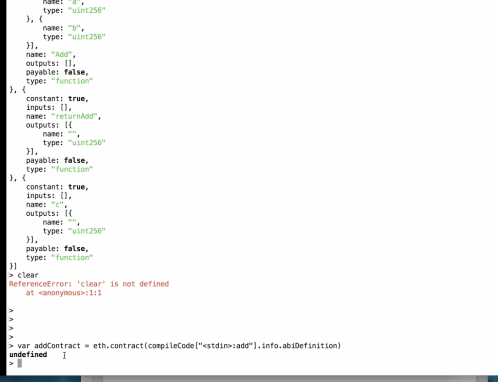

# Day 2
By Benjamin M. Brown @benjaminmbrown

## Intro
#### Instructor: Neeraj S Srivastava

   Today we are exploring creating smart contracts the 'hard way' first, then learning to debug individual contracts with solidity, and finally how we can use truffle for enterprise contract deployment.

Warning: These are my personal notes, so there may be typos throughout. I am just trying to get the technical details of contract code / creation and skipping the side conversations for the most part.

* DLT Labs - Distributed Ledger Technology
* R3 Corda
* Truth vs. Consensus
* Blockchain is an ecosystem - not a technology
* DLT has 13 verticals in the ecosystem
  * examples infrastructure, programming, security, cryptography, philosophy, strategy
* Pick a vertical & stick to it
* Consensus - Proof of Stake vs. Proof of Authority vs. Byzantine Fault Tolerance vs. PoW
* JP Morgan R3 Corda - takes base of ethereum with newer components - fork of ethereum
  * DLT vs Blockchain. (Coda = DLT != Blockchain) - ( Eth, BTC = blockchain)
    * Coda has a centralized server that assigns the leader
  * Ethereum is very modular - has proof of work and proof of authority in module
  * Can switch consensus algorithm after launch (with effort) while everything else remains the same
* Byzantine fault tolerance theory
  * Incentivizes systems to try to come in sync where before there was no incentive
  * Old databases can only be updated one record at a time - if n number of nodes, who gets the right to update the db at any given time?

## Smart Contract creation in GETH 

   Go through geth smart contract creation in detail and understand the fundamentals of how to manually create a smart contract, compile it, and upload to blockchain

### 1. To create a smart contract

   Contract example:

```
pragma solidity ^0.4.0;
contract add {
    uint public c;
    
    function Add(uint a, uint b){
        c = a + b;
    }
    function returnAdd() constant returns (uint) {
        return c;
    }
}
```

### 2. Compiling the Smart Contract

   We need to convert contract code from higher level languages (C++, Python, Solidity, etc) into code that can run on the blockchain (it is called the bytecode).
 
* create sourcecode variable w/ code in string
* `var sourceCode = "pragma solidity ^0.4.0; contract add ..."`
* `var compileCode = eth.compile.solidity(sourceCode)`
* output of `compileCode` is now in bytecode hex (code: attribute) which is what the blockchain understands

(In this image, find  ` "<stdin>:add:{ code: " ` and the bytecode follows there in hex)



   ### ABI Definition

        The ABI is separate from the contract code/bytecode. ABI defines the contract name, the functions, and the required parameters within each function. For anyone to be able to call the contract, it needs to know these attributes explicitly. We need to manually build the ABI every time we want to prepare a contract for launching on the network.
  * contract can call another contract or outside world
  * The interface: in order to call, you need to name/address of the contract, function name, and parameters needed

* `compileCode["<stdin>add"].info.abiDefinition` returns example object:
```
[{
    constant: false,
    inputs: [{
        name: "a",
        type: "uint256",
    },{
        name: "a",
        type: "uint256",
    }
    ],
    name: "Add",
    outputs: [],
    payable: false,
    type: "function"

},
{...}
]
```


* To call a contract you NEED the ontract address and ABI definition

### 3. Create the contract object

   Before we upload, we need to create an object which has all of the details that blockchain interprets.

`var addContract = eth.contract(compileCode["<std>:add"].info.abiDefinition)`


### 4. Create a transaction 
   Need to create a transaction to put on the network:

   ```
   var addTransaction = addContract.new({
       from: eth.coinbase,
       data: compileCode["<stdin>:add"].code,
       value, 0,
       gas: 1000000
   },
   function(err,contract){
       if(err){
           console.error(err);
       } else {
           console.log(contract);
           console.log(contract.address);
       }
   });
   ```

## Using Remix

   Good as a debugger for singular contracts and debugging. Not for enterprise development

* Shows how Remix works behind the scene

## Truffle Framework

   When using multiple contracts, truffle is useful for interacting contracts. Use when deployment and testing
