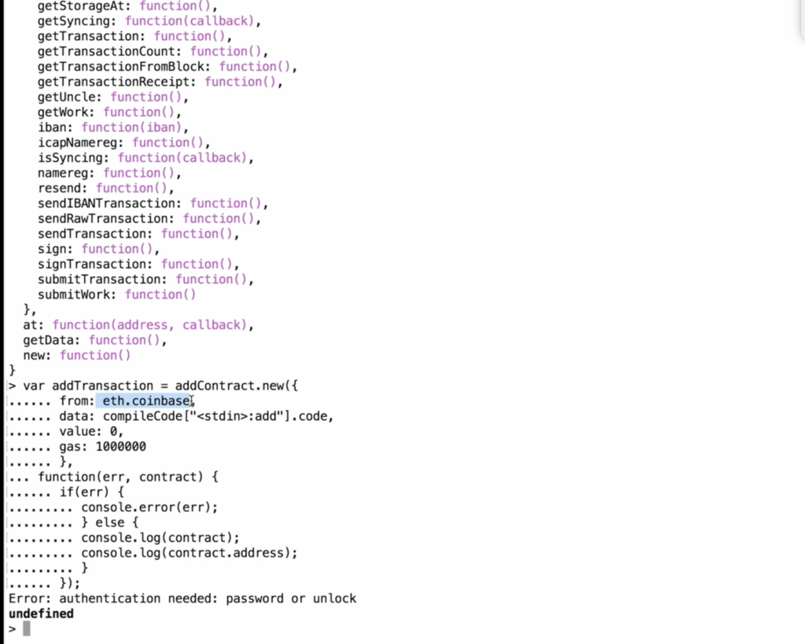

# Day 2
By Benjamin M. Brown T: [@benjaminmbrown](http://twitter.com/benjaminmbrown) - G: [@benjaminmbrown](http://github.com/benjaminmbrown)

## Intro
## Instructor: Neeraj S Srivastava

   Today we are exploring creating smart contracts the 'hard way' first, then learning to debug individual contracts with solidity, and finally how we can use truffle for enterprise contract deployment.

Warning: These are my personal notes, so there may be typos throughout. I am just trying to get the technical details of contract code / creation and skipping the side conversations for the most part.

* DLT Labs - Distributed Ledger Technology
* R3 Corda
* Truth vs. Consensus
* Blockchain is an ecosystem - not a technology
* DLT has 13 verticals in the ecosystem
  * examples infrastructure, programming, security, cryptography, philosophy, strategy
* Pick a vertical & stick to it
* Consensus - Proof of Stake vs. Proof of Authority vs. Byzantine Fault Tolerance vs. PoW
* JP Morgan R3 Corda - takes base of ethereum with newer components - fork of ethereum
  * DLT vs Blockchain. (Coda = DLT != Blockchain) - ( Eth, BTC = blockchain)
    * Coda has a centralized server that assigns the leader
  * Ethereum is very modular - has proof of work and proof of authority in module
  * Can switch consensus algorithm after launch (with effort) while everything else remains the same
* Byzantine fault tolerance theory
  * Incentivizes systems to try to come in sync where before there was no incentive
  * Old databases can only be updated one record at a time - if n number of nodes, who gets the right to update the db at any given time?

## Smart Contract Creation and Launch in GETH 

   Go through geth smart contract creation in detail and understand the fundamentals of how to manually create a smart contract, compile it, and upload to blockchain

#### 1. Create Contract Source Code

   Contract source code example:

```
pragma solidity ^0.4.0;
contract add {
    uint public c;
    
    function Add(uint a, uint b){
        c = a + b;
    }
    function returnAdd() constant returns (uint) {
        return c;
    }
}
```

#### 2. Compiling the Smart Contract

   We need to convert contract code from higher level languages (C++, Python, Solidity, etc) into code that can run on the blockchain (it is called the bytecode).
 
* create sourcecode variable w/ code in string
* `var sourceCode = "pragma solidity ^0.4.0; contract add ..."`
* `var compileCode = eth.compile.solidity(sourceCode)`
* output of `compileCode` is now in bytecode hex (code: attribute) which is what the blockchain understands

(In this image, find  ` "<stdin>:add:{ code: " ` and the bytecode follows there in hex)


   ### ABI Definition
   The ABI is separate from the contract code/bytecode. ABI defines the contract name, the functions, and the required parameters within each function. For anyone to be able to call the contract, it needs to know these attributes explicitly. We need to manually build the ABI every time we want to prepare a contract for launching on the network.
  * contract can call another contract or outside world
  * The interface: in order to call, you need to name/address of the contract, function name, and parameters needed

* `compileCode["<stdin>:add"].info.abiDefinition` returns example object:
```
[{
    constant: false,
    inputs: [{
        name: "a",
        type: "uint256",
    },{
        name: "a",
        type: "uint256",
    }
    ],
    name: "Add",
    outputs: [],
    payable: false,
    type: "function"

},
{...}
]
```


* To call a contract you NEED the ontract address and ABI definition

#### 3. Create the contract object

   Before we upload, we need to create an object which has all of the details that blockchain interprets.

`var addContract = eth.contract(compileCode["<std>:add"].info.abiDefinition)`


#### 4. Create a transaction 

FIRST: Must supply your private key to unlock your account before you can send a transaction/upload a contract.

`personal.unlockAccount("0x343143831943189")'

   Need to create a transaction to put on the network.

* During a normal transaction, data is optional
* During contract upload `addContract.new()` , data contains the hex code of the compiled contract code that will be run on Ethereum Virual Machine stack.

   ```
   var addTransaction = addContract.new({
       from: eth.coinbase,
       data: compileCode["<stdin>:add"].code,
       value, 0,
       gas: 1000000
   },
   function(err,contract){
       if(err){
           console.error(err);
       } else {
           console.log(contract);
           console.log(contract.address);
       }
   });
   ```


#### Successfully Uploaded Contract with Transaction ID

See your transaction, if it is mined, and if it has tx's
`eth.getTransaction("your tx ID")`
* block number = null until it is mined

#### How to call a deployed contract

Call one of the created functions:

## Using Remix

   Good as a debugger for singular contracts and debugging. Not for enterprise development

* Shows how Remix works behind the scene

### Our contract

copy/paste in to Remix

```
pragma solidity ^0.4.0;

contract Calculator {
    uint addResult;
    function addNumber (uint n1, uint n2) {
        addResult = n1 + n2;
    }
    function getResults() constant returns (uint) {
        return addResult;
    }
}
```

   To run the program, you must first create it. On the right side create will create the contract and publish so you can interact.

   After creating, below the create area will be a small area with your function names . In the `addNumber` input, put in two numbers. To retrieve the results, you have to call the `getResults` function from the same area. It will display the addition.


   Note: everything is a state variable. 

   If you just want to temporarily use a variable, create storage variables like:
   `uint[4] storage localStorage3;`
   `uint[] memory localMemory1;`

### Default Variables List
3 parts - `storage`, `memory` and `calldata`

* `storage`- merkle tree in side block data
* `memory` - space in blockchain / essentially VRAM
* `calldata` - when you call a function 


#### Forced Data Location - you can't change
  * Parameters (not return) of external functions: calldata
  * State Variables: storage

#### Default Data Location
* Parameters (also return) of functions: memory
* All other local variables: storage

1. Only complex structure like array and structs can have data location

2. Constant value give in contract is equivalent to memory
* ex [1,2,3,4,5] equivalent to uint8 memory
* [uint(1), 2,3,4,5] equiv to uint256 memory

3. Array with data location
* Storage can push
* memory can not push

4. Storage array can get & set .length

5. Memory can only get .length

6. State variables can be storage only


## Truffle Framework

   When using multiple contracts, truffle is useful for interacting contracts. Use when deployment and testing
