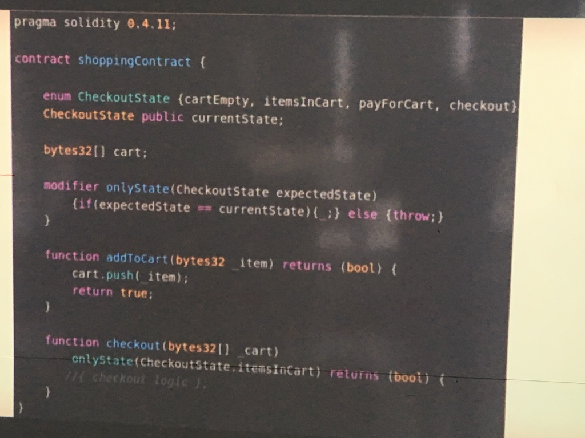

# Day 3
Benjamin M. Brown T: [@benjaminmbrown](http://twitter.com/benjaminmbrown) - G: [@benjaminmbrown](http://github.com/benjaminmbrown)

## Intro
Instructor: Stu Peters, CTO - stu@chainsafe.io

[Data Types](#Data-Types)

## Data Types
[Int](#Int)
[Bool](#Bool)
[Untyped](#Untyped)

### Int

`int x`

`unint 256 y = 187;` (unsigned, integer does not go negative, commonly used)

`uint constant z = 512;`

### Bool

`bool x;`

`bool y = true;`

`bool constant z = false;`


### Untyped

`var x;`

### Address

Address is an ethereum address

`address public user;`

-Public declaration creates a function that exposes the value of the variable to external users of the contract.

### String

A string is only accessible from the contract itself. External contracts can not access this data type.

`string lang = "Solidity"`

### Byes

A byte is like a string but can be exposed publicly - more commonly used.

`byte x;`;

### Array

Common data structure, collection. In solidity you can only keep same types of information in an array

`bytes32[] arr1;` - dynamic, can be as long as you want

`bytes32[3] fixedArr;`- static, only fit 3

### Mapping
Mapping is two types that are user defined (a key and value)

`mapping (address => uint256) public balances;`

Example:

```
pragma solidity 0.4.19;

contract Coin { 
    address owner;
    mapping(address => uint) public balances;

    function Coin(uint _supply){
        owner = msg.sender;
        balances[owner] += _supply;
    }
}

```

### Contract Call
 Doesn't cost any gas (free). `constant returns` signifies it as a Contract Call.

```

mapping (address => uint256) public balances;

function queryBalance ( address _addres) constant returns (uint256 balance){
    return balances[_address];
}

```

Example contract that has calls and mutations



### Cost of Gas in Solidity
* To send 1 ether = 21,000 gas
* Every byte on top of that is 5gas

## Control Structures

`if`

`else`

`while`

`for`

`break`

`continue`

`return`

no switch statement - use an if / else chain

## Global variables

### Block

`block.coinbase` - address

`block.difficulty` - (uint)

`block.gaslimit` - (uint)

`block.number` - (uint)

`block.blockhash` - (function(uint) returns (bytes32))

`block.timestamp` or `now` - (uint)

### Message or msg

`msg.data` -

`msg.gas` -

`msg.sender` - address of person that is making transaction to the smart contract

`msg.value` - the amount of wei that was sent to the contract in the transaction

To store an image - store a hash of the address stored somewhere else.

### Transaction or tx

`tx.gasprice` - (uint)

`tx.origin` - (uint) - use this when contract factory is spinning out multiple contracts to ensure you're getting a unique tx origin as very first sender of tx.

A -> B -> C

you -> contract factory -> smart contract

address -> msg.sender -> tx.origin

NOTE: All state changes are atomic.
We learned how to avoid re-entrancy attacks

### Global Variables

`now` - (uint) - same as `block.timestamp`

`this` - refers to the current instance of the contract

`kill` - kills public 

## User-defined data structures

### Structs

```

struct testStruct {
    address testAddr;
    uint testUint;
}

```

* The second type in a mapping can be a Struct

Example:

```

contract Structs {

    mapping ( uint => A) test;

    struct A {
        address address;
        uint num;
    }
    
    function returnStruct() constant returns (address, uint){
        return A.addr, A.num;
    }
}

```
* EVM can't return structs as objects
* must get properties explicitly (see returnStruct above)

Research task: Compare struct notations vs. javascript objects

### Enum
Allows you to build your contracts into a finite state machine. An object has x amount of states which it HAS to be in at any given time. 

Example: Shopping cart states (empty, addedToCard, payForCart, checkout)

`enum CheckoutState{empty, addedToCard, payForCart, checkout}`

`if(CheckoutState.empty === true) `

### Mapping

`mapping (address => uint256) public balances;`
